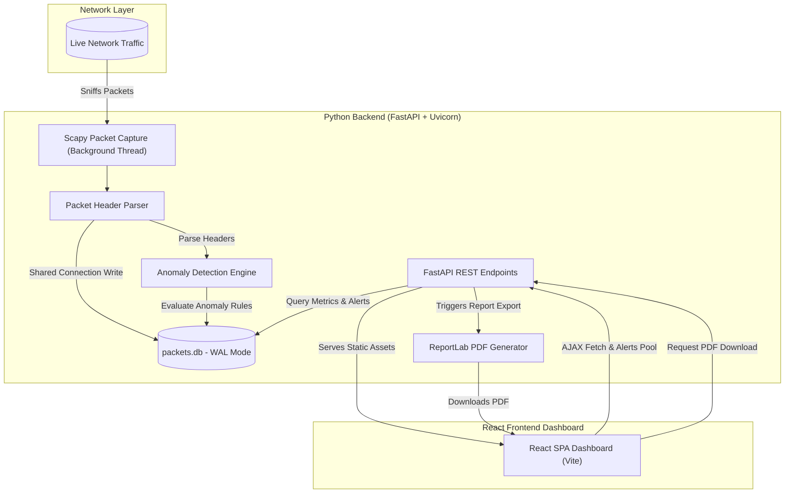

# 🛡️ Netwatch: Advanced Network Traffic Analyzer & Anomaly Detector

Netwatch is a premium, real-time network traffic analyzer and anomaly detection system. It combines high-throughput packet sniffing using Scapy, optimized SQLite data persistence, a FastAPI REST API, and a beautiful React dashboard to visualize network metrics and alert on potential security threats.

---

## 🏗️ Architecture Overview

Netwatch runs as a single concurrent application, utilizing a multi-threaded Python backend to sniff network traffic and run anomaly detection while serving REST API endpoints and hosting the React frontend dashboard on a single port.



---

## ✨ Key Features

- **🚀 Real-Time Packet Sniffing**: Uses Scapy to capture live packets, extracting timestamp, source/destination IPs, ports, protocols (TCP, UDP, ICMP), and packet size.
- **⚡ Database WAL Optimization**: Persists capture records to an SQLite database with **Write-Ahead Logging (WAL)** enabled (`PRAGMA journal_mode=WAL;`), reducing locking contention and maximizing write throughput.
- **🔍 Anomaly Detection Engine**: Evaluates live traffic metrics on a sliding window:
  - **Port Scans**: Detects source IPs attempting to connect to more than 15 unique destination ports within a 10-second window.
  - **Traffic Spikes**: Detects source IPs exceeding a configured traffic bandwidth threshold (default 5MB) within a 10-second window.
  - **Suspicious Ports**: Instantly flags traffic routing through high-risk Trojan/Botnet ports (`4444`, `6667`, `31337`).
- **📊 FastAPI REST API**: Exposes endpoints for real-time dashboard data, historical connections, bandwidth timeline, and security alerts.
- **📈 Single-Port Unified Hosting**: The built static React SPA is mounted directly to the FastAPI server route (`/`), allowing hosting of the dashboard and API on a single port.
- **📄 Professional PDF Export**: Generates dynamically styled network reports on demand using ReportLab with detailed tables, charts, and summary statistics.

---

## 📂 Project Structure

```text
Netwatch/
├── frontend/                   # React Frontend Dashboard (Vite, HSL CSS styling)
│   ├── dist/                   # Compiled static frontend build
│   ├── src/                    # React components and hooks
│   └── package.json
├── netwatch/                   # Python Backend Package
│   ├── __init__.py
│   ├── anomaly.py              # Port scan, traffic spike, and suspicious port rule engine
│   ├── api.py                  # FastAPI REST routes and single-port mounting
│   ├── capture.py              # Scapy-based packet listener & parser
│   ├── database.py             # SQLite helper functions, schema, and WAL config
│   └── main.py                 # Main entry point (argparse CLI runner)
├── requirements.txt            # Python dependencies
└── .gitignore
```

---

## 🚦 Getting Started

### 📋 Prerequisites

1. **Python 3.8+**
2. **Node.js 18+** (for frontend development & compilation)
3. **Npcap / WinPcap (Windows Only)**:
   - Packet capture on Windows requires **Npcap** to interface with layer 2 network packages.
   - Download and install Npcap from the official portal: [https://npcap.com/](https://npcap.com/).
   - Ensure the option **"Install Npcap in WinPcap API-compatible Mode"** is checked during setup.

> [!IMPORTANT]
> Running packet capture requires **Administrator / Root privileges** on your shell. Ensure you run your terminal/shell as Administrator.

---

### 🔧 Installation & Setup

1. **Clone the Repository**:
   ```bash
   git clone https://github.com/sujeettiwari036/Netwatch.git
   cd Netwatch
   ```

2. **Configure Python Virtual Environment**:
   ```bash
   python -m venv .venv
   .venv\Scripts\activate   # On Windows (PowerShell/CMD)
   source .venv/bin/activate  # On Linux/macOS
   ```

3. **Install Backend Dependencies**:
   ```bash
   pip install -r requirements.txt
   ```

4. **Build Frontend Static Assets**:
   ```bash
   cd frontend
   npm install
   npm run build
   cd ..
   ```
   *This compiles the React SPA into static HTML/JS/CSS assets inside `frontend/dist/`.*

---

### 💻 Running Netwatch

To run Netwatch, activate your virtual environment, open an elevated shell (Administrator), and execute `netwatch/main.py`.

```bash
# General CLI Command
.venv\Scripts\python -m netwatch.main [options]
```

#### ⚙️ CLI Parameter Options:

| Option | Flag | Description | Default |
| :--- | :--- | :--- | :--- |
| **Help** | `-h`, `--help` | Display command-line parameters | |
| **Interface Selection** | `-i`, `--interface` | Specify interface name (e.g. `Wi-Fi`, `Ethernet`) | Automatic selection |
| **List Interfaces** | `-l`, `--list` | List available network interfaces and exit | |
| **Database Path** | `-d`, `--db` | Filepath to save the SQLite database | `packets.db` |
| **Host IP** | `--host` | IP address to run the FastAPI server on | `127.0.0.1` |
| **Server Port** | `--port` | Port to run the FastAPI server on | `8000` |

#### 📝 Running Examples:

- **List all network interfaces**:
  ```bash
  .venv\Scripts\python -m netwatch.main -l
  ```
- **Run capture on specific interface and custom database**:
  ```bash
  .venv\Scripts\python -m netwatch.main -i "Wi-Fi" -d custom_packets.db --port 8081
  ```
- **Access the Dashboard**:
  Open your web browser and navigate to: `http://localhost:8000/` (or the custom port if specified).

---

## 📡 REST API Specifications

The FastAPI server exposes several query endpoints for external tools, integration, or custom frontends:

| Endpoint | Method | Response Description |
| :--- | :--- | :--- |
| `/packets/recent` | `GET` | Returns the last 100 parsed connection records |
| `/stats/top-talkers` | `GET` | Aggregated traffic volume grouped by source IP |
| `/stats/protocol-breakdown` | `GET` | Protocol distribution count (TCP vs UDP vs ICMP) |
| `/stats/bandwidth-timeline` | `GET` | Bytes captured in 10-second intervals for the last 5 minutes |
| `/alerts` | `GET` | Returns list of logged security/network alerts |
| `/report` | `GET` | Triggers dynamically generated PDF report download |

---

## 🛡️ License

This project is licensed under the Apache 2.0 License - see the `LICENSE` details if applicable.
